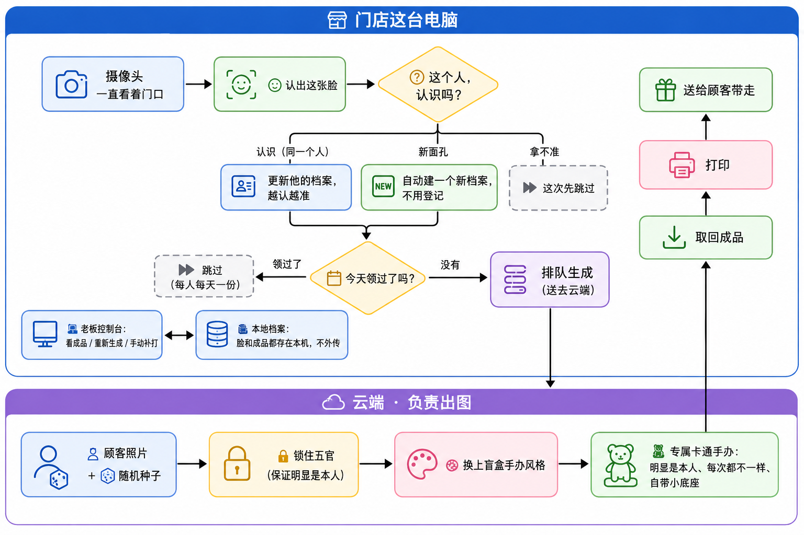
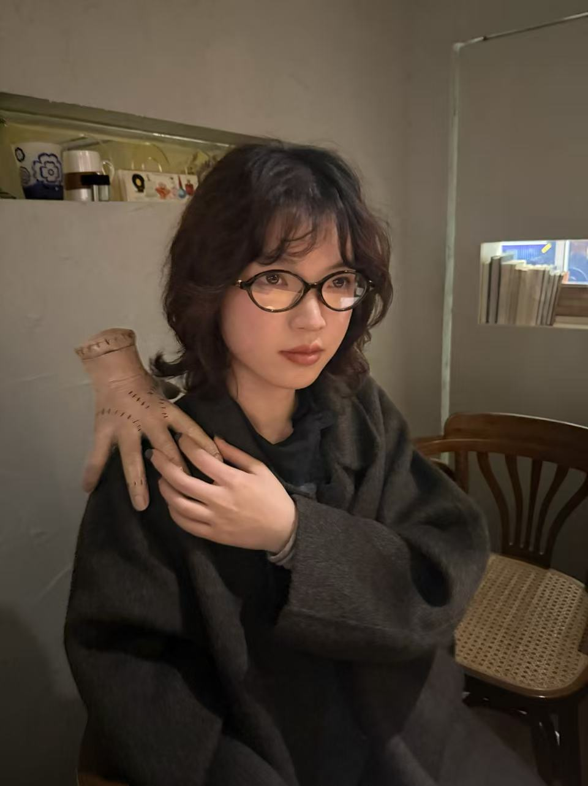
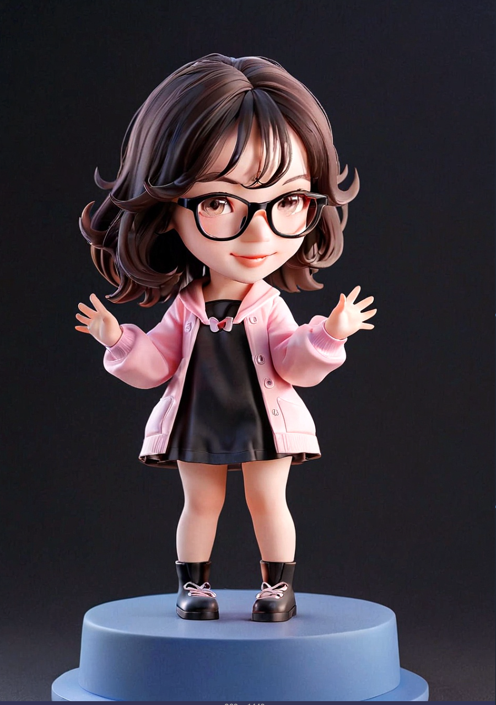
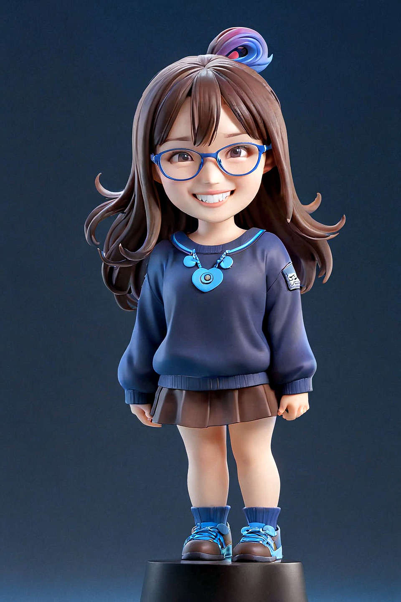

<h1 align="center">🎭 HEYOU</h1>

<p align="center"><a href="README.md">中文</a> | <b>English</b></p>

<p align="center"><b>Brick-and-mortar venues · Show your face, get a personalized AI cartoon figurine · Printed on the spot</b></p>

<p align="center">
  
  
  
  
  
</p>

The moment a customer shows their face, the camera recognizes them and **auto-files them**, and the system instantly generates a personalized cartoon figurine that's **unmistakably them — yet different every time**, then **prints it on the spot** as a keepsake to take home. **No enrollment required** — when the same person visits again, the system automatically clusters those faces into one person in the background, getting more accurate and more like them over time.

In short: turn a **face-scan** into a personalized, scarce, take-home, share-worthy surprise gift — a **memorable, shareable** differentiator for brick-and-mortar venues.

```text
Customer arrives → 📷 Recognize & auto-file on sight → 🧠 Cluster to a person (better with every visit) → 🗓 Once per person per day → 🎨 Cloud-generate personalized cartoon (same identity · never repeats) → 🖨 Print keepsake on the spot
```

> 📖 **Reading guide** — Owners: [What it delivers](#-what-it-delivers-for-your-venue) · [Quick Start](#-quick-start) · [FAQ](#-faq). Investors: [Value & Moat](#-business-value--moat).

<!-- Tip: drop a console screenshot / a face-scan→print demo GIF here — most compelling -->

## 🆕 Core Model: Get It on Sight, Regulars Emerge Automatically

HEYOU is no longer an "**enroll first, then recognize**" regulars-gating system. The core flow now is:

- **Everyone who shows up gets one** — any face in front of the camera is auto-filed and generated. Zero enrollment, zero staff action.
- **Regulars are recognized by the system itself** — when the same person returns, their face is automatically **clustered into the same person** (many views per person, ever more accurate) — no tagging by staff.
- **Once per person per day** — dedup is per *person*, controlling cost while creating a "come back for today's drop" scarcity.
- **Pure-regulars mode still available** — to serve only pre-enrolled regulars, set `orchestration.auto_enroll` to `false`.

> This is the **fundamental business-logic difference** from earlier versions: from "reward pre-enrolled regulars" to "get it on sight, with the regular relationship accreting automatically in the background."

## 📋 Recent Updates

- ✅ **2026-07-14** **Auto-enroll · cluster every face to a person**: no longer limited to pre-enrolled regulars — **any face that shows up is auto-filed**; each detected face is matched against the known database, merged into the **same person's feature library** if it's a returning face (more views → better recognition over time) or filed as a **new person** if not, then generated and printed as before (once per person per day). Includes a quality gate (rejects side/blurry faces), a **two-threshold decision** (fewer mismatches and duplicate records), a per-person library cap, automatic cleanup of inactive visitors, and an optional **global daily cap** for cost.
- ✅ **2026-07-14** **Full Windows parity**: real printing on the **Liene PixCut S1 with AI die-cut stickers** now works on Windows too, and the whole recognize → generate → print loop has been validated on real hardware. **Mac and Windows run the same code with identical features** — hands-free auto-printing on either. Setup in [docs/WINDOWS.md](docs/WINDOWS.md).
- ✅ **2026-06-23** Printing upgraded to the **Liene PixCut S1 cut-printer**: real printing by driving the official app, with **AI die-cut** (sticker cut along the subject's contour) or plain full-bleed printing; the print backend toggles between `system` (OS CUPS/win32print printer) and `pixcut` (PixCut S1). Includes a **debug mode** (runs the whole print flow but never clicks "Cut" — no print, no ribbon) and **continuous-print self-healing** (restart the print app every N prints to clear accumulated canvases).

## 🎯 What It Delivers for Your Venue

| Pain point | How HEYOU solves it |
| --- | --- |
| Homogeneous experience, nothing memorable | A **personalized cartoon** that's unmistakably them and one-of-a-kind — perfect for photos and social check-ins |
| No hook to bring customers back | A **get-it-on-sight, once-per-person-per-day** scarce gift — and the system recognizes returning customers automatically, building a "come back for today's drop" habit |
| Campaigns are hard and costly to run | **Zero enrollment, zero action** — everyone who shows up is auto-recognized, auto-filed, auto-generated; staff never touch a button |
| Online spread is hit-or-miss | A take-home physical card = a **social-sharing vehicle** that carries your brand (branded card template on the roadmap) |

**For staff**: zero action — customers are recognized, filed, and printed fully automatically; there's a "manual reprint" fallback when things get busy.
**For owners**: runs on an ordinary computer (**Mac or Windows**) + a camera + a printer, with heavy compute in the cloud — **launch and validate with minimal investment**.

## ✨ Highlights

- ✅ **Recognize on sight · auto-cluster to a person** — InsightFace (SCRFD detection + ArcFace embeddings) + cosine similarity; a **two-threshold** decision: merge into the same person if similar enough, create a new person if clearly not, skip if uncertain — "**better to miss than to misidentify**"; more views per person = ever more accurate.
- ✅ **Same identity · never the same twice** — PuLID + InstantID lock the facial features (**unmistakably them**); a random seed makes **every render different** — no duplicates.
- ✅ **Multiple pose templates** — "Standing figurine" and "Cross-legged" already supported, each with a display base; templates are extensible.
- ✅ **Once per person per day** — per-person dedup; controls cost and creates scarcity (count configurable, with a global daily cap as a backstop).
- ✅ **Owner console (dark nightclub style)** — paginated visitor/regular management / manual enroll / generation history / one-click regenerate / **manual-print fallback** / live status.
- ✅ **Async generation, never blocks** — each ≈2.3 min cloud render is handled by a dedicated worker, **never blocking the camera loop**; in-flight & same-day guards.
- ✅ **Edge + Cloud architecture** — the local computer only runs recognition and scheduling; heavy generation lives in the cloud — **flexible, controllable compute cost**.
- ✅ **Pluggable generation backend** — switch between `mock` (offline self-test, free) and `runninghub` (real generation) in one setting.
- ✅ **Real printing · die-cut stickers** — supports the **Liene PixCut S1 cut-printer** (AI die-cut along the subject's contour) and ordinary system printers, switchable in one setting, with **real printing on both Mac and Windows**; includes a **debug mode** (runs the full flow without printing / consuming ribbon) and continuous-print self-healing.
- ✅ **Cross-platform parity** — the same code runs identically on **macOS and Windows 10**: recognition, generation, and printing are all validated end-to-end on real hardware.
- ✅ **Automatic visitor cleanup** — auto-filed visitors are purged after a configurable period of inactivity, so the feature library never grows unbounded (manually enrolled regulars are unaffected).

## 📊 How It Works



## 🖼 Examples

> A plain front-facing photo in, an "unmistakably them, with a base" cartoon figurine out.

<table>
<tr>
<td width="50%" align="center"><b>Real Photo (input)</b><br/><sub>in-venue customer portrait</sub></td>
<td width="50%" align="center"><b>Personalized Cartoon Figurine (output)</b><br/><sub>same identity · random every time</sub></td>
</tr>
<tr>
<td align="center"></td>
<td align="center"></td>
</tr>
</table>

<table>
<tr>
<td width="50%" align="center">🧍 <b>Standing template</b><br/><sub>full body + round display base</sub><br/></td>
<td width="50%" align="center">🧘 <b>Cross-legged template</b><br/><sub>seated pose + integrated base</sub><br/></td>
</tr>
</table>

## 🚀 Quick Start

```bash
# 1) Install dependencies (auto-creates .venv, Python 3.11)
uv sync

# 2) Start the demo console (also auto-starts face recognition)
uv run python scripts/run_server.py
#    → opens http://127.0.0.1:8000

# (optional) self-check before going live: recognition / DB / generation backend
uv run python scripts/smoke_test.py

# (optional) validate the "auto-enroll → cluster" decision logic (offline, no camera, free)
uv run python scripts/smoke_autoenroll.py
```

After launch: **customers are recognized, filed, generated, and printed automatically on arrival (once per person per day) — no enrollment needed**; in the console you can view results, regenerate, manually reprint, and also manually enroll/manage regulars.

> 🪟 **Windows 10**: the same code runs on Windows with identical features (PixCut real printing or a system printer, camera adapts automatically) — see **[docs/WINDOWS.md](docs/WINDOWS.md)** for setup and printer configuration.

## ⚙️ Configuration

Global configuration lives in `config.yaml`.

| Key | Description |
| --- | --- |
| `generation.backend` | `mock` (offline self-test, free) \| `runninghub` (real cloud generation) |
| `generation.runninghub.workflow_id` | which workflow (standing / cross-legged use different IDs) |
| `orchestration.auto_enroll` | **Auto-enroll master switch** (default `true`): every in-venue face is auto-filed and clustered to a person; set `false` to fall back to the old "pre-enrolled regulars only" mode |
| `recognition.match_high` · `match_low` | auto-cluster **two thresholds** (cosine similarity, higher = stricter): `≥ match_high` → same person, merge into their library; `< match_low` → new person; in between → uncertain, skip |
| `recognition.min_face_px` · `enroll_min_det_score` · `enroll_max_pose_deg` | quality gates: min face pixels / min detection confidence / max pitch-yaw angle — loosen these to make recognition catch **more** faces |
| `orchestration.daily_limit` | max generations per person per day (default `1`) |
| `orchestration.global_daily_cap` | all-users daily generation ceiling for cost safety (`0` = unlimited) |
| `storage.history_retention_days` | days to keep generation history (default `3`) |
| `storage.visitor_retention_days` | purge auto-filed visitors after N days of inactivity (default `30`; manually enrolled regulars unaffected) |
| `printing.enabled` | auto-print toggle (currently `false`; manual print as fallback, enable once hardware is finalized) |
| `printing.backend` | print backend: `system` (OS printer: CUPS on mac/Linux, win32print on Windows) \| `pixcut` (drives the official app for die-cut stickers, **mac + Windows**) |
| `printing.pixcut.cutout` · `dry_run` · `restart_every` | AI die-cut (sticker cut along contour) / debug mode (full flow, no real print / ribbon) / restart the app every N prints to clear canvases |
| `logging.max_bytes` · `backup_count` · `retention_days` | service-log rotation size · kept rotations · prune-on-startup age (default `5MB × 5` ≈ 25MB) |

## ❓ FAQ

**Q: What happens to people who aren't pre-enrolled?**
A: This is exactly the point of the new version — by default it **auto-enrolls every face**: anyone who shows up is filed automatically, repeat visits are clustered into one person (recognition improves and looks more like them as views accumulate), new faces create a new person, and it generates + prints as usual. **No enrollment whatsoever.** To serve only pre-enrolled regulars, set `orchestration.auto_enroll` to `false`.

**Q: Why only once per day per person?**
A: It controls cloud cost and creates an "exclusive scarcity" that encourages return visits. The count is configurable in `config.yaml`; you can also set `orchestration.global_daily_cap` as an all-users daily ceiling for cost safety.

**Q: How close is the likeness?**
A: InstantID + PuLID lock the facial features — **unmistakably them**; a random seed varies the pose and details each time — **same identity, never a repeat**.

**Q: Could it misidentify someone / split one person into several?**
A: Auto-clustering uses **two thresholds** (`recognition.match_high` / `match_low`): merge into an existing person only when similar enough, create a new person only when clearly different, and skip anything uncertain — "better to miss, or even file a duplicate, than to wrongly merge into someone else." Tune it via `match_high` / `match_low` and the quality gates (`min_face_px`, etc.). (Note: the legacy `match_threshold` is used only by the offline `smoke_test.py` — the live recognition path **does not read it**.)

**Q: How is privacy handled?**
A: Face **embeddings** and portraits are stored **locally** in SQLite and never leave the machine; only the portrait is sent to RunningHub at generation time. With auto-enroll on, in-venue faces are captured automatically; auto-filed visitors are purged after `storage.visitor_retention_days` (30 by default) of inactivity. For a real deployment, handle local notice/consent and retention compliance.

**Q: Roughly how much does it cost?**
A: Local recognition is free; each generation consumes RunningHub paid credits, capped at one per person per day (with a global daily cap as a backstop) — overall controllable. Use the `mock` backend for zero-cost self-testing.

**Q: Any printer requirements?**
A: Two backends, switched via `printing.backend` in `config.yaml`: `system` uses any OS printer (CUPS on mac/Linux, win32print on Windows); `pixcut` drives the **Liene PixCut S1 cut-printer**'s official app for **AI die-cut** stickers (cut along the subject's contour) and full-bleed prints — **works on both macOS and Windows**. To validate the whole chain without consuming ribbon, use `printing.pixcut.dry_run` (runs the full flow but doesn't really print). Auto-print (`printing.enabled`) is off by default with manual fallback, to be enabled once the on-site setup is finalized.

> PixCut backend note (Mac & Windows): it prints by automating the official PixCut app, so **that app must be open and signed in**; a print takes over the screen for 1–3 minutes — **don't touch the mouse/keyboard during it**. On macOS, first-time use needs Accessibility + Screen Recording permission for the terminal that launches the server; Windows needs no extra permission. Step-by-step setup in [docs/WINDOWS.md](docs/WINDOWS.md).

## 💎 Business Value & Moat

**Why now**

- Mature generative AI + the rise of the offline experience economy — "show your face, get a personalized IP" is finally low-friction to deploy
- A venue only needs an ordinary computer + camera + printer, with heavy compute in the cloud — **validate first, invest later**

**The hook**

- **Personalized** (unmistakably them) × **Scarce** (once per person per day) × **Take-home** (physical card) × **Shareable** (social spread)
- **Zero-friction experience**: get it on sight — no QR scan, no signup, no staff enrollment

**Technical moat (not "just a filter")**

- **Identity-consistent, controllable, templated generation**: lock the face (InstantID/PuLID) + lock pose & base (prompt engineering, ControlNet next) + controlled randomness — "different every time, yet unmistakably them"
- **Auto identity-clustering on sight**: two thresholds + quality gates + a multi-embedding library per person keep recognizing the same person ever more accurately with no manual tagging, while suppressing wrong merges and duplicate records
- **Edge–cloud decoupling + pluggable backend**: switch scenes by swapping templates; flexible compute cost
- **Productized end-to-end loop**: recognize → cluster → dedup → async generate → print, with scheduling, status monitoring and fallbacks — already validated on real hardware

**Transferability**

- The same engine ports to **restaurants / livehouses / expos / pop-ups / attractions / brand events** — a general "get-a-personalized-avatar-on-sight" capability

**Potential business models**

- All-in-one hardware + consumables (stickers) + SaaS subscription / per-print revenue share; a unified multi-store platform for chains; venue-owned IP skins / collaborations / seasonal editions
